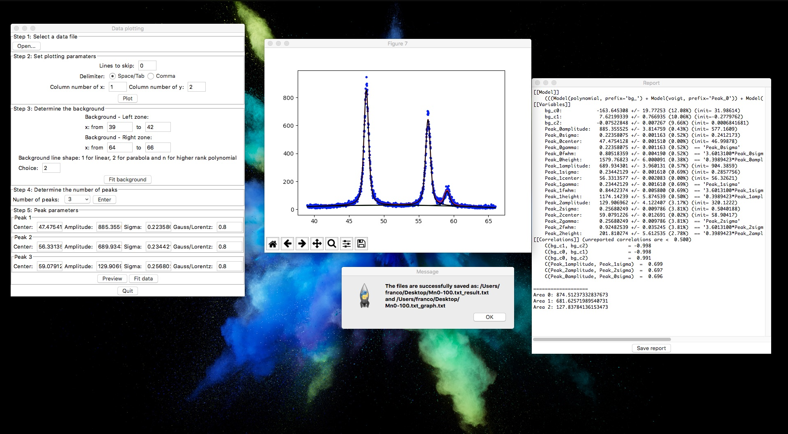

# Exp_SciTools
Basic tools for scientific research.

## Scripts
* PeakFitting.py and Fitting_GUI.py

    Used for fitting multi-peaks in a spectrum.

    Instant download (without installing any dependent packages): [For Mac](./Packages/PeakFitting_GUI_mac.zip) or [For Windows](./Packages/PeakFitting_GUI_Windows.zip)

* Integration.py and Integration_GUI.py

    Used for integrate peak area for a spectrum.

* Plotting.py and Plotting_GUI.py

    Used for plotting.

* Converter.py

    Used for convert flowmeter data.

* LatexCompile.sh

    Used for compile .tex files. (Only tested in Mac.)

## Dependencies
- lmfit package (PeakFitting/Integration)
- mpltex package (Plotting)
- numpy, scipy, matplotlib packages
- Tkinter package (Converter.py)
- LaTeX compiler, MacTeX for example (LatexCompile)

